# Metix Azure Deployment Factory

Repository di accompagnamento al workshop V-Valley per Metix, a cura di Emanuele Ciminaghi.
Durata: 3 ore, 10:00-13:00. Baseline didattica v0.1, da approvare con Metix prima dell'uso su progetti reali.

**Standard -> Bicep/AVM -> Pull Request -> controlli -> approvazione -> Azure.**
GitHub Copilot accelera la scrittura e la revisione; non sostituisce policy, test o autorizzazioni.

## Da dove iniziare

| Obiettivo | Guida |
| --- | --- |
| Preparare il PC e provare il kit senza Azure | [Primo utilizzo](docs/getting-started.md) |
| Capire regole obbligatorie, default ed eccezioni | [Standard Metix](docs/standards.md) |
| Comprendere risorse, rete, DNS e scelte WAF | [Architettura](docs/architecture.md) |
| Configurare Resource Group, OIDC e GitHub | [Bootstrap e identita](docs/bootstrap.md) |
| Aprire una PR, leggere il What-If e rilasciare | [Pipeline e deployment](docs/deployment.md) |
| Usare Copilot con il contesto del repository | [Guida Copilot](docs/copilot.md) |
| Condurre la sessione e gli esercizi | [Workshop e guida trainer](docs/workshop.md) |
| Gestire errori, recovery e fine demo | [Runbook operativo](docs/operations.md) |
| Verificare la consegna e i test eseguiti | [Checklist di consegna](docs/handover.md) |

## Perimetro della demo

- Un Resource Group **preesistente**, preparato separatamente dal workload.
- Una VNet con subnet app, data e private endpoint.
- Key Vault con RBAC, soft delete, purge protection e accesso pubblico disabilitato.
- Storage Account con accesso pubblico e Shared Key disabilitati; endpoint privato per Blob.
- Private Endpoint, Private DNS Zone e collegamenti DNS alla VNet per Key Vault e Blob.
- Log Analytics e diagnostic settings per i servizi inclusi nel pattern.
- Parametri DEV, TEST e PROD con lo stesso codice infrastrutturale.

Non sono inclusi applicazione, VM, dati o segreti dimostrativi, connettivita dal PC alla VNet,
landing zone aziendale o certificazione di idoneita alla produzione.
Le subnet app e data sono riservate a estensioni future, non contengono compute.

## Struttura

```text
.github/
  copilot-instructions.md
  instructions/                Regole Bicep e GitHub Actions
  prompts/                     Prompt riusabili in VS Code
  workflows/                   CI locale, preview Azure, deploy manuale
  pull_request_template.md
infra/
  main.bicep                   Entry point a scope Resource Group
  parameters/                  dev, test, prod
  modules/                     Network, monitoring, private access, servizi
scripts/                       Validazione locale, guardrail, post-check
docs/                          Guide di utilizzo e consegna
.vscode/                       Estensioni consigliate
bicepconfig.json                Regole di lint
```

## Primo controllo, senza deployment

Dopo aver installato i prerequisiti della [guida iniziale](docs/getting-started.md), dalla root:

```powershell
pwsh -File scripts/Test-Repository.ps1
```

Il controllo compila Bicep e parametri, applica i guardrail locali e verifica i link delle guide.
Il primo restore dei moduli richiede Internet. Non richiede login Azure e non crea risorse.

## Flusso di lavoro

```mermaid
flowchart LR
    Requirement[Requisito e standard] --> Code[Bicep e parametri]
    Code --> PR[Pull Request]
    PR --> CI[Build e guardrail locali]
    CI --> Preview[Validate e What-If autorizzati]
    Preview --> Review[Review e merge]
    Review --> Plan[What-If del commit da rilasciare]
    Plan --> Approval[Approvazione environment]
    Approval --> Deploy[Deploy manuale con OIDC]
    Deploy --> Check[Post-check e log]
```



La CI delle PR non riceve credenziali Azure. La preview autenticata viene lanciata da un maintainer,
su un commit controllato, tramite un environment protetto. Il deploy parte solo manualmente da `main`.
Nessuna PR esegue automaticamente un deployment.

## Prima di usare Azure

1. Approvare standard, nomi, CIDR, region e costi con il responsabile Metix.
2. Seguire il bootstrap con un amministratore autorizzato.
3. Configurare identita OIDC separate per preview e deployment e i relativi permessi.
4. Proteggere branch ed environment GitHub, controllando le funzionalita disponibili nel piano GitHub.
5. Provare DEV end-to-end prima del workshop e conservare evidenze reali.

**La presenza dei file non configura Azure o GitHub.** I parametri di esempio non sono un'approvazione
per TEST o PROD. L'esito dei controlli locali non dimostra disponibilita delle SKU, permessi,
compliance Azure Policy o raggiungibilita del data plane. Consultare la checklist di consegna.

## Costi e sicurezza

Private Endpoint, Private DNS, Storage e Log Analytics possono generare costi anche in una demo.
Budget e alert non interrompono automaticamente la spesa. Non viene fornita una stima commerciale
senza conoscere subscription, durata, volumi e tariffe applicabili.

Non inserire segreti, file di login o dati cliente nel repository. Gli identificativi di tenant,
subscription e client si configurano nelle variabili degli environment GitHub, non nei template.
Il kit non assegna privilegi amministrativi e non crea ruoli sul data plane.

## Contribuire

Seguire [CONTRIBUTING.md](CONTRIBUTING.md), aprire una PR e allegare controlli, What-If e tradeoff WAF.
Per segnalazioni riservate leggere [SECURITY.md](SECURITY.md). Riferimenti ufficiali nelle singole guide
e in [docs/references.md](docs/references.md).