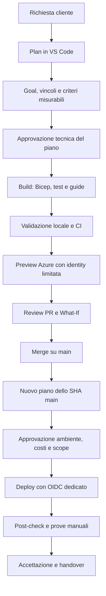

# Azure Deployment Factory

Questo repository e' un template operativo per progettare, verificare e distribuire workload Azure con Infrastructure as Code, GitHub Actions e GitHub Copilot in VS Code. Non e' un prodotto gia' pronto per qualunque cliente e non crea risorse Azure finche' un tecnico autorizzato non completa bootstrap, preview, approvazioni e deploy.

Il primo pattern incluso dimostra un baseline PaaS privato: Key Vault, Storage Blob, rete privata, DNS privato e diagnostica. Ogni cliente reale parte invece dal proprio goal, dai propri vincoli e dai propri criteri di accettazione.

## A cosa serve

- Raccogliere il goal di un cliente in modo strutturato e verificabile.
- Separare progettazione, implementazione IaC, review, preview e deploy.
- Usare Bicep e Azure Verified Modules con versioni esplicite.
- Bloccare modifiche rischiose prima del provisioning, per esempio public access, Shared Key, rimozione di RBAC o parametri incoerenti.
- Conservare tracciabilita tra goal, commit, artifact, ambiente, cliente e verifiche.

Non sostituisce competenza tecnica, review di piattaforma, Azure Policy, RBAC, approvazioni economiche o test live. Un workflow verde non significa automaticamente che il goal del cliente sia accettato.

## Come funziona il flusso



1. Il tecnico descrive il risultato desiderato nella chat GitHub Copilot di VS Code, usando l'agente **Plan**.
2. Il piano chiarisce dati, rete, utenti, carico, disponibilita, recovery, budget, risorse esistenti e criteri misurabili.
3. Dopo approvazione umana, **Build** produce o aggiorna goal, Bicep, test e documentazione.
4. La PR esegue solo controlli senza credenziali Azure.
5. La preview autenticata usa codice fidato da `main`, verifica binding cliente/ambiente e produce What-If.
6. Il deploy avviene solo da `main`, con environment protetto e approvazione separata.
7. Le evidenze postdeploy e le prove manuali completano l'accettazione del cliente.

## Struttura del repository

| Percorso | Scopo |
| --- | --- |
| [workload/goal.json](workload/goal.json) | Contratto del cliente/workload: obiettivo, vincoli, ambienti e requisiti verificabili. |
| [workload/goal.schema.json](workload/goal.schema.json) | Schema del goal. |
| [infra/main.bicep](infra/main.bicep) | Entry point Bicep a scope Resource Group. |
| [infra/modules/](infra/modules/) | Moduli Bicep che compongono rete, accesso privato, servizi e monitoraggio. |
| [infra/parameters/](infra/parameters/) | Parametri DEV/TEST/PROD di esempio o del workload. |
| [scripts/](scripts/) | Build, validazione goal, guardrail e post-check. |
| [docs/](docs/) | Factory, architettura, bootstrap, deployment, operations, workshop e consegna. |
| [.github/](.github/) | Istruzioni Copilot, agenti, prompt e workflow GitHub Actions. |

Il goal incluso ha `purpose: reference`: serve a dimostrare il processo e passa i controlli locali, ma viene rifiutato dai gate autenticati prima del login Azure. Per un cliente reale va sostituito con un goal `customer` revisionato.

## Modello cliente e progetto

Per ambienti reali il modello raccomandato e' **un repository privato per ogni coppia cliente/workload**. Per esempio:

```text
factory-contoso-portale-documentale
factory-fabrikam-data-platform
```

Questo mantiene separati codice, OIDC trust, environment, variabili, evidenze, history e permessi. Creare una cartella per ogni cliente dentro lo stesso repository puo' sembrare piu' comodo, ma aumenta il rischio di esposizione incrociata, errori di target, permessi troppo larghi e confusione tra goal, subscription e prove.

Ha invece senso organizzare meglio **dentro il repository del singolo cliente/workload** la conoscenza di progetto, per esempio:

```text
workload/
  goal.json
  discovery.md
  questions.md
  decisions.md
  acceptance.md
docs/
  architecture.md
  deployment.md
  operations.md
infra/
  main.bicep
  modules/
  parameters/
```

Questa struttura puo' raccogliere domande/risposte, decisioni, assunzioni, criteri di accettazione ed evidenze senza mischiare clienti diversi. Se un cliente ha piu' progetti realmente indipendenti, la scelta preferita resta un repository per progetto/workload. Se invece sono componenti dello stesso workload, possono convivere nello stesso repo con moduli e documentazione espliciti.

## Interfaccia web

Un'interfaccia web puo' avere senso come strato di facilitazione, non come scorciatoia ai gate. Il valore principale sarebbe guidare l'operatore nella raccolta delle informazioni e ridurre errori di forma.

Funzioni utili:

- Wizard per cliente, workload, ambienti, rete, dati, requisiti, RTO/RPO, budget e dipendenze.
- Generazione assistita di `goal.json`, bozze di `discovery.md`, `questions.md` e `decisions.md`.
- Vista dello stato: controlli locali, PR, preview, What-If, approvazioni, deploy ed evidenze.
- Checklist di bootstrap, variabili GitHub environment e binding `CUSTOMER_CODE`.
- Collegamenti a prompt Copilot, agenti il team e guide operative.

Vincoli da rispettare:

- Non deve contenere segreti, subscription ID hard-coded o credenziali.
- Non deve creare risorse o approvare costi automaticamente.
- Non deve aggirare PR, workflow, environment protection, review o RBAC.
- Non deve fingere che Copilot abbia eseguito test o accettato requisiti.
- Deve trattare la chat Copilot come supporto di progettazione/implementazione, non come autorita di approvazione.

Dal punto di vista tecnico, l'integrazione diretta con la chat GitHub Copilot di VS Code non va assunta come API stabile. Una prima versione piu' robusta puo' essere una web app interna che genera file e prompt, apre PR o issue, mostra artifact e guida l'utente a usare Copilot in VS Code. In seguito si puo' valutare una GitHub Copilot Extension o un'integrazione dedicata, mantenendo separati audit, permessi e approvazioni.

## Primo utilizzo

Leggere nell'ordine:

1. [docs/getting-started.md](docs/getting-started.md)
2. [docs/factory.md](docs/factory.md)
3. [docs/standards.md](docs/standards.md)
4. [docs/architecture.md](docs/architecture.md)
5. [docs/copilot.md](docs/copilot.md)
6. [docs/deployment.md](docs/deployment.md)
7. [docs/operations.md](docs/operations.md)

Per validare localmente senza creare risorse:

```powershell
pwsh -File scripts/Test-Repository.ps1
```

Il comando compila Bicep, valida parametri e goal, esegue guardrail e controlla link/documentazione. Non richiede login Azure e non effettua provisioning.

## Dal template al cliente reale

1. Creare un repository privato dal template per il cliente/workload.
2. Configurare accessi, branch protection, CODEOWNERS reali, workflow ed environment protetti.
3. Usare **Plan** per produrre un piano approvabile, non per scegliere subito servizi.
4. Usare **Build** solo dopo approvazione del piano.
5. Sostituire il goal di riferimento con un goal cliente, completo di requisiti e verifiche.
6. Aggiornare IaC, test e guide nel perimetro approvato.
7. Eseguire `pwsh -File scripts/Test-Repository.ps1` e aprire PR.
8. Eseguire preview autenticata, leggere il What-If e approvare solo se scope/costi/rischi sono chiari.
9. Eseguire deploy da `main` con environment protetto.
10. Raccogliere evidenze e completare handover.

Preparare file o prompt non autorizza provisioning, spesa Azure, assegnazione ruoli, merge, push o cancellazione risorse.

## Stato attuale del kit

Implementato:

- Pattern PaaS privato con Key Vault e Storage Blob.
- Bicep/AVM a scope Resource Group.
- Parametri DEV/TEST/PROD di esempio.
- Goal strutturato e validazione schema.
- Guardrail statici e test negativi rappresentativi.
- Workflow per validate, preview e deploy controllato.
- Guide operative e runbook.

Non implementato come funzionalita generale:

- Catalogo universale di tutti i servizi Azure.
- Applicazione web del cliente.
- Backup/restore indipendente, DR multi-region o SLO applicativo.
- Test automatici di DNS privato da rete cliente.
- Accettazione automatica dei requisiti manuali.
- Onboarding remoto automatico di repository, environment, federazioni OIDC o ruoli Azure.
- Interfaccia web il team.

## Regola pratica

La factory deve rendere ogni passaggio piu' esplicito: per chi e' il workload, quale risultato serve, quali rischi sono accettati, quale codice cambia, quale identity agisce, quale ambiente viene toccato e quale evidenza dimostra il risultato. Se una semplificazione rende meno chiara una di queste domande, va trattata come rischio da progettare, non come dettaglio operativo.