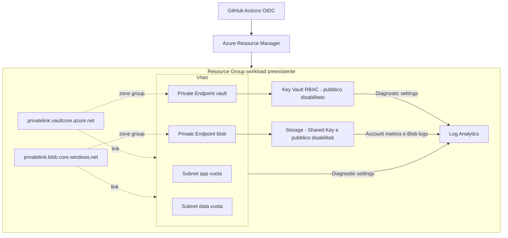

# Architettura del workload demo

Il repository **descrive** un workload, non prova che sia gia' stato distribuito.
Scope dell'entry point: Resource Group. Il RG e le identita di automazione vengono preparati separatamente.
Azure public cloud, Italy North; non sono validati cloud sovrani o reti con DNS centralizzato esistente.

Questo e' il primo pattern della [factory multi-cliente](factory.md), non l'architettura obbligatoria
di ogni cliente. I nuovi workload partono dal proprio goal e richiedono un piano e test specifici.
La factory aggiunge agenti Copilot, contratto del goal e gate di pipeline senza aggiungere risorse
Azure al pattern. Il goal di riferimento incluso non autorizza preview o provisioning.

## Tracciabilita del riferimento

| Requisito | Scelta implementata | Verifica | Limite |
| --- | --- | --- | --- |
| REQ-001 | Guardrail sui wrapper AVM compilati | Test-Baseline in CI e test negativi | Non interpreta genericamente ARM e non prova il risultato live |
| REQ-002 | Proprieta KV/Storage, tag e connessioni PE | Test-DeployedResources dopo deploy | Solo management plane, nessuna operazione dati |
| REQ-003 | Zone private e link VNet | Runbook DNS/TCP da client privato | Manuale, client non incluso, non prova autorizzazione applicativa |

I criteri esatti sono nel [goal](../workload/goal.json). Questa matrice descrive copertura pianificata,
non esecuzione o accettazione: non sono state eseguite prove Azure. Nel repository cliente sostituirla
con requisiti e scelte approvati, senza ereditare esiti dal riferimento.

## Componenti

## Composizione Bicep

| File | Responsabilita | Dipendenze |
| --- | --- | --- |
| [main](../infra/main.bicep) | Parametri, naming, tag, orchestrazione | Resource Group esistente |
| [monitoring](../infra/modules/monitoring.bicep) | Log Analytics PerGB2018 | Nessuna risorsa workload precedente |
| [network](../infra/modules/network.bicep) | VNet, tre subnet, diagnostica | Workspace |
| [private-access](../infra/modules/private-access.bicep) | Due zone DNS e link senza autoregistration | VNet |
| [services](../infra/modules/services.bicep) | Vault, Storage/Blob, due PE, zone group e diagnostica | Workspace, subnet PE, zone DNS |

Le dipendenze sono ricavate dagli output dei moduli. Nessuna assegnazione RBAC applicativa, nessun
segreto e nessun container Blob vengono creati. Gli output espongono soltanto identificativi di risorsa.

## Moduli verificati

Versioni selezionate dal catalogo AVM e compilate localmente il 16 settembre 2026:

| Modulo | Versione |
| --- | --- |
| `avm/res/network/virtual-network` | 0.10.2 |
| `avm/res/network/private-dns-zone` | 0.8.1 |
| `avm/res/key-vault/vault` | 0.14.2 |
| `avm/res/storage/storage-account` | 0.33.0 |
| `avm/res/operational-insights/workspace` | 0.16.1 |

I moduli vengono scaricati da `mcr.microsoft.com` durante il restore. `enableTelemetry: false`
disabilita la telemetria opzionale AVM nelle istanze chiamate; non disabilita la diagnostica Azure.
Un aggiornamento di versione puo' cambiare default, API e child resource: review, build e What-If obbligatori.

## Networking e DNS

Le subnet app e data sono vuote, predisposte per esercizi futuri. `defaultOutboundAccess: false`
non fornisce un percorso di uscita: un'app futura richiedera' un disegno di egress e NSG approvato.
Non sono inclusi Public IP, NAT Gateway, firewall, VPN, Bastion, peering o resolver privato.

I PE sono nella terza subnet. I zone group registrano gli indirizzi nelle zone DNS private, collegate
alla VNet. Il client deve usare il nome pubblico ordinario del servizio; dalla rete privata il percorso
DNS lo risolve verso il relativo endpoint privato.

- Vault: `<nome>.vault.azure.net` e zona `privatelink.vaultcore.azure.net`.
- Blob: `<nome>.blob.core.windows.net` e zona `privatelink.blob.core.windows.net`.
- File, Queue, Table e DFS non hanno endpoint privati in questo pattern.

Un PC esterno o un runner GitHub-hosted non ha accesso al data plane solo perche' e' autenticato.
Con DNS aziendale servono forwarding e una rete connessa, da disegnare prima del test.
Non duplicare zone private gia' centralizzate: l'integrazione con DNS esistente e' una variante da approvare.

## Sicurezza e identita

Storage: HTTPS, TLS 1.2, encryption at rest gestita dal servizio e infrastructure encryption,
Shared Key disabilitata, nessun accesso Blob anonimo, public network Disabled e network ACL Deny/None.
Blob: versioning, soft delete di blob e container per 7 giorni. Le versioni possono aumentare il costo.

Key Vault: SKU standard, RBAC, purge protection e retention soft delete di 90 giorni.
La purge protection impedisce la cancellazione definitiva prima della scadenza e non e' reversibile
come un normale booleano dopo l'abilitazione. Pianificare riuso del nome e recovery.

Le identita OIDC pipeline appartengono al bootstrap. Non accedono a segreti o blob.
Un'app futura usera' managed identity e un ruolo data plane minimo, non Contributor generico.
Privatizzare la rete non assegna autorizzazioni; RBAC non crea connettivita.

## Osservabilita

Log Analytics: PerGB2018, retention 30 giorni DEV/TEST e 90 nell'esempio PROD, local auth disabilitata.
Diagnostica: KV allLogs/AllMetrics; VNet allLogs/AllMetrics; Storage account AllMetrics;
Blob service allLogs/AllMetrics. Disponibilita e flusso reale delle categorie devono essere provati su Azure.
Nessun daily cap, budget, action group o alert viene creato. Una quota giornaliera sui log non sarebbe
un tetto garantito di spesa e potrebbe interrompere la visibilita degli eventi.

I PE e le zone DNS non ricevono diagnostic settings generici: categorie e osservabilita vanno verificate
per risorsa. Non sono inclusi VNet flow logs o la raccolta dell'Activity Log di subscription.
Gli endpoint LAW rimangono pubblici autenticati: il kit non include Azure Monitor Private Link Scope.

## Delivery, recovery e limiti

CI locale -> preview autenticata del commit proposto -> review/merge -> nuova preview del commit main
-> approvazione environment -> deploy dello stesso artifact compilato -> post-check di management plane.
La preview controlla goal e parametri con il validatore/schema del commit main fidato, prima del login.
Il deploy verifica che subscription, RG, ambiente, commit, cliente e hash del goal corrispondano al piano.
CUSTOMER_CODE proviene dall'environment protetto; la sua corrispondenza amministrativa al
target Azure deve essere verificata nel bootstrap. Il codice cliente non e' un confine di sicurezza RBAC.
Il riepilogo finale ricorda le prove manuali ma non ne attesta l'esecuzione o l'accettazione del goal.
Non blocca il drift Azure tra preview e applicazione; se l'approvazione e' vecchia, rifare la run.

La modalita Incremental conserva risorse non piu' dichiarate, ma puo' comunque cambiare o rimuovere
proprieta e child resource di quelle gestite. Non fornisce un rollback transazionale.
Un revert Git richiede una nuova PR/preview e non ripristina dati, segreti o risorse rinominate.

Questo e' un pattern single-region senza workload applicativo, NSG, backup indipendente, DR,
SLO o test di performance. Il parametro PROD non certifica una configurazione produttiva.
Tradeoff dettagliati in [standards](standards.md); procedure in [operations](operations.md).