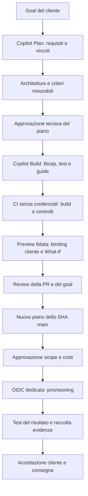

# Factory Azure: dal goal al risultato verificato

## Modello di utilizzo

il team mantiene questo repository come **template comune**. Per ogni cliente e workload crea un
repository privato separato, per esempio `factory-cliente-a-documenti` e `factory-cliente-b-portale`.
I nomi sono esempi: nessun repository remoto o cliente reale e' stato creato.
Gli ambienti DEV/TEST/PROD appartengono a quel cliente/workload, non sono tre clienti differenti.

Il tecnico descrive l'obiettivo a GitHub Copilot in VS Code. Copilot aiuta a raccogliere requisiti,
progettare e produrre Bicep/AVM, test e documentazione. I workflow GitHub Actions eseguono verifiche
e provisioning con identita ristrette. Le approvazioni sono di persone autorizzate, non del modello.



## Cosa e' implementato

- Due agenti VS Code, Plan e Build, con tool limitati. Nessuno dispone del terminale o di tool di mutazione Azure.
- [Goal strutturato](../workload/goal.json) con [schema](../workload/goal.schema.json): cliente, workload, obiettivo, vincoli, ambienti e requisiti verificabili.
- Validazione strutturale, unicita degli ID requisito, presenza di verifiche postdeploy e riferimenti alle suite/runbook.
- Blocco delle suite automatiche non collegate alla pipeline; il JSON non puo' introdurre comandi da eseguire.
- Gate pre-login che rifiuta il goal di riferimento, clienti/ambienti errati e parametri incoerenti.
- Copia del goal nell'artefatto di piano e hash SHA256 nel manifest; il deploy confronta cliente, goal, SHA e target.
- Primo pattern eseguibile: Key Vault e Blob privati con rete e monitoraggio. Codice Bicep esistente conservato.

**Non e' un verificatore universale di qualsiasi infrastruttura.** Per un goal diverso Copilot puo'
progettare e implementare una nuova soluzione, ma servono suite specifiche, review di piattaforma
e prove live. Il fatto che un requisito indichi un file test non dimostra che quel test misuri davvero
il requisito: la corrispondenza semantica deve essere revisionata da un tecnico competente.

## Onboarding di un cliente

1. Su GitHub un amministratore marca il repository centrale come Template. Questa impostazione non viene creata dai file.
2. Usa `Use this template` per creare un repository privato del cliente/workload. Non mettere piu' clienti in cartelle dello stesso repo.
3. Assegna accessi solo al team autorizzato. Configura subito PR obbligatorie, CODEOWNERS reali e protezioni dei workflow.
4. Apri il repository in VS Code e seleziona **Plan** dal menu degli agenti della chat.
5. Descrivi il goal e rispondi alle domande. Conferma il piano solo dopo aver risolto i vincoli rilevanti.
6. Seleziona **Build**, richiama il piano approvato e chiedi goal, codice, test e guide coerenti.
7. Nel goal imposta `purpose: customer` e un codice cliente non sensibile. Non basta cambiare questi due campi: sostituisci obiettivo, vincoli e criteri di esempio con quelli approvati.
8. Esegui i controlli locali e fai review. Per una nuova famiglia di risorse qualificare anche le suite e il flusso di preview.
9. Completa il [bootstrap](bootstrap.md) nella subscription/tenant del cliente, con approvazione separata di identita, ruoli e costi.
10. Configura `CUSTOMER_CODE` in ogni environment protetto, identico al codice del goal, insieme alle quattro variabili Azure.
11. Prova preview, gate e deploy in DEV; poi raccogli le evidenze di ogni requisito e completa l'accettazione.

Non copiare variabili, federazioni o identita del cliente A nel repository B. Un amministratore verifica
che codice cliente, nome repository, tenant, subscription, RG, identity e subject OIDC corrispondano.
Il controllo della stringa cliente previene errori di selezione; **non sostituisce RBAC e la verifica
amministrativa dell'effettiva proprieta della subscription**.

La creazione da template non replica protezioni, credenziali federate, environment, secret, history
o aggiornamenti successivi del template. Il codice si eredita, la configurazione di sicurezza va rifatta.

## Esempio di richiesta

```text
Per il cliente alfa dobbiamo predisporre Azure per un portale documentale.
Il portale deve essere accessibile solo dalla rete aziendale e non deve usare
credenziali statiche per accedere ai dati. Servono DEV e PROD.
Aiutami a definire i requisiti mancanti: utenti e carico, rete esistente, dati,
backup, RTO/RPO, regione e budget. Non scegliere subito i servizi.
Proponi poi architettura, alternative, tradeoff WAF e criteri di accettazione.
Non modificare file e non creare risorse.
```

Non e' sufficiente distribuire lo Storage della demo per soddisfare questo goal: vanno progettati
anche hosting del portale, identita applicativa, accesso utenti, rete e recovery. L'agente deve
renderlo esplicito, non restituire automaticamente il template esistente.

Dopo l'approvazione del piano:

```text
Implementa il piano tecnico che ho approvato per questo cliente.
Produci il goal strutturato, Bicep/AVM, test di sicurezza e del risultato,
e guide coerenti. Indica le suite nuove e come collegarle alla pipeline.
Non eseguire provisioning o operazioni Git remote; evidenzia cio' che resta
da verificare localmente e su Azure.
```

## Contratto dei requisiti

Per ciascun REQ-nnn nel goal:

| Campo | Significato |
| --- | --- |
| description | Esigenza del cliente, non soltanto il nome di una risorsa |
| acceptance | Esito misurabile e condizione di successo |
| verification.phase | Prima o dopo provisioning |
| verification.method | Automatica oppure manuale |
| verification.path | Suite effettivamente collegata oppure runbook esistente |
| verification.evidence | Quale evidenza raccogliere, non il risultato inventato |
| verification.owner | Responsabile della prova e della sua interpretazione |

Il goal non contiene campi `approved` o `passed`: un file scritto da Copilot non deve auto-certificare
una decisione. La PR conserva l'approvazione tecnica sullo SHA; gli environment proteggono il rilascio.
I requisiti manuali predeploy devono essere verificati dal reviewer prima di autorizzare il deploy.
Non esiste un blocco automatico basato su un verbale manuale o su un flag nel goal.

Esempi di verifiche che vanno oltre il build:

| Goal | Prova del risultato |
| --- | --- |
| Servizio privato | DNS verso gli IP PE attesi; accesso dalla rete ammessa e tentativo negato da quella non ammessa |
| Accesso senza chiavi | Operazione riuscita con managed identity autorizzata, negata a identita senza ruolo |
| Recupero entro RTO | Restore temporizzato di dati di test autorizzati, non sola presenza del backup |
| Prestazioni concordate | Carico e soglie misurati con protocollo ripetibile |
| Limite economico | Stima approvata e verifica consumi; un budget Azure non e' un hard cap |

Queste prove **non sono tutte implementate nella demo**. Per test privati serve un client/runner
autorizzato con connettivita e DNS. Non eseguire mai codice PR su runner privilegiati del cliente.

## Aggiungere nuovi pattern

La prima versione include soltanto le suite PaaS della demo. Per aggiungere un pattern VM, web,
database o altro, il responsabile il team deve:

1. Approvare il piano e i guardrail applicabili, indicando nuovi rischi e confini rispetto al baseline.
2. Implementare suite con asserzioni e test negativi propri del pattern, riusando i controlli pertinenti.
3. Collegare le suite ai comandi della CI e ai post-check. Aggiornare il registro `wiredSuites` in [Test-WorkloadGoal](../scripts/Test-WorkloadGoal.ps1).
4. Fare prima una PR dei validatori fidati con test e review, senza nuove risorse. Dopo il merge main puo' riconoscere le nuove suite nella preview.
5. Nella PR infrastrutturale usare le nuove suite: il codice candidato resta privo di credenziali e il job autenticato usa validatori da main.
6. Verificare permessi della preview/deployment, quote, region, Policy, costi, test funzionali e runbook.
7. Provare in una sandbox autorizzata e conservare le evidenze. Solo allora promuovere il pattern nel catalogo riusabile.

La lista di suite riconosciute e' intenzionalmente chiusa: un nuovo file test non diventa attendibile
solo perche' il goal lo nomina. I parametri DEV/TEST/PROD e i moduli attuali sono ancora quelli del
pattern PaaS; non rappresentano un catalogo gia' implementato di tutti i servizi Azure.

## Accettazione e manutenzione

Dopo il deploy verde, per ogni requisito registrare: ID, esito osservato, link alla run/test o verbale,
SHA e hash goal, cliente, subscription/RG/ambiente, data e reviewer. Conservare eventuali prove di
accesso negato, routing e recovery richieste dal piano. Non inserire segreti nelle evidenze.

Il riepilogo Actions ricorda le verifiche manuali, ma non conclude automaticamente "goal soddisfatto".
Il reviewer completa l'accettazione solo quando tutte le prove pertinenti sono positive o un requisito
viene formalmente rinegoziato. Un fallimento dopo il deploy richiede remediation, non falso verde.

il team mantiene versioni del template e distribuisce aggiornamenti con PR revisionate ai repository
cliente. Non sovrascrivere i workload con la versione nuova del template. In seguito si potranno
estrarre workflow riusabili e moduli il team versionati; non esiste aggiornamento automatico tra repo.

Separazione per cliente significa piu' onboarding e manutenzione, ma riduce esposizione incrociata
di dati e credenziali. Goal e test espliciti aumentano il lavoro iniziale, ma rendono verificabile la
decisione. Nessun prompt, AVM o pipeline da solo garantisce sicurezza assoluta o raggiungimento di
qualsiasi goal: servono competenza tecnica, autorizzazioni, controlli indipendenti e prove reali.